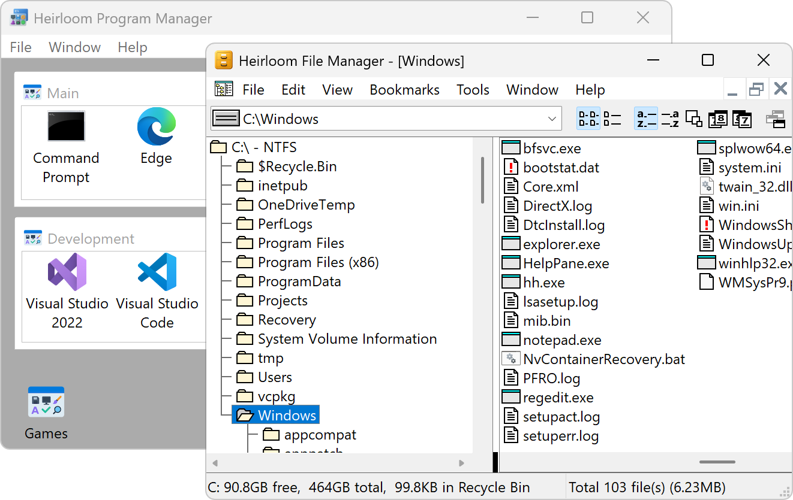

<h1 align="center">&nbsp; Heirloom apps</h1>

<h3 align="center">Lightly modernized classics for Windows</h3>

###  Heirloom Program Manager
An alternative to the Start menu for launching applications. This is a reimplementation of [Program Manager](https://en.wikipedia.org/wiki/Program_Manager).

- Organize shortcuts into groups
- Double-click a shortcut to open

###  Heirloom File Manager
An alternative to File Explorer for basic file and folder organization tasks. This is a fork of [Windows File Manager](https://github.com/microsoft/winfile).

- High-DPI screen support
- Recycle Bin
- Bookmarks
- Drag and drop
- Zip archives

## Licenses

These apps are free and open source.

- [Heirloom File Manager license](../src/winfile/LICENSE)
- [Heirloom Program Manager license](../src/progman/LICENSE)
